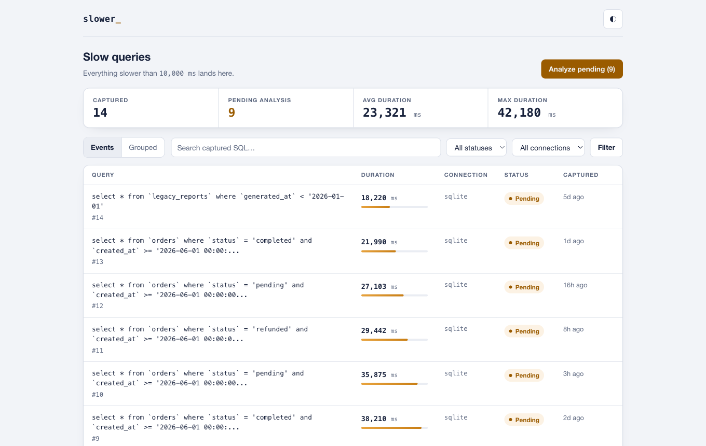
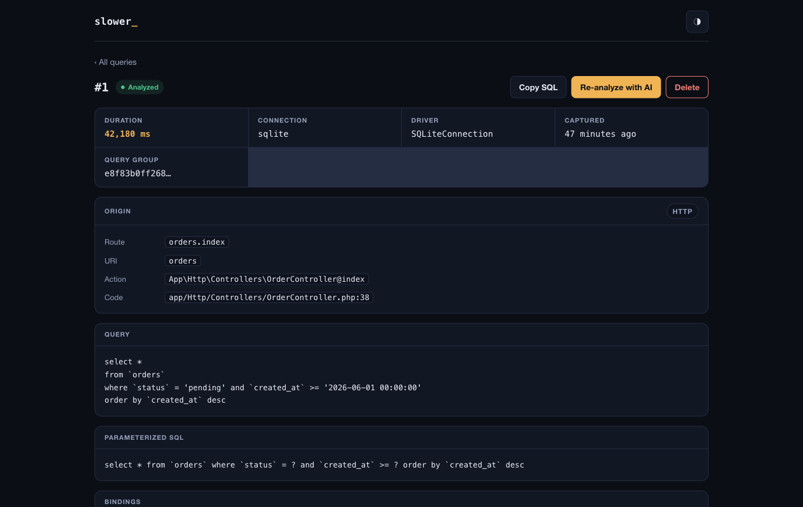
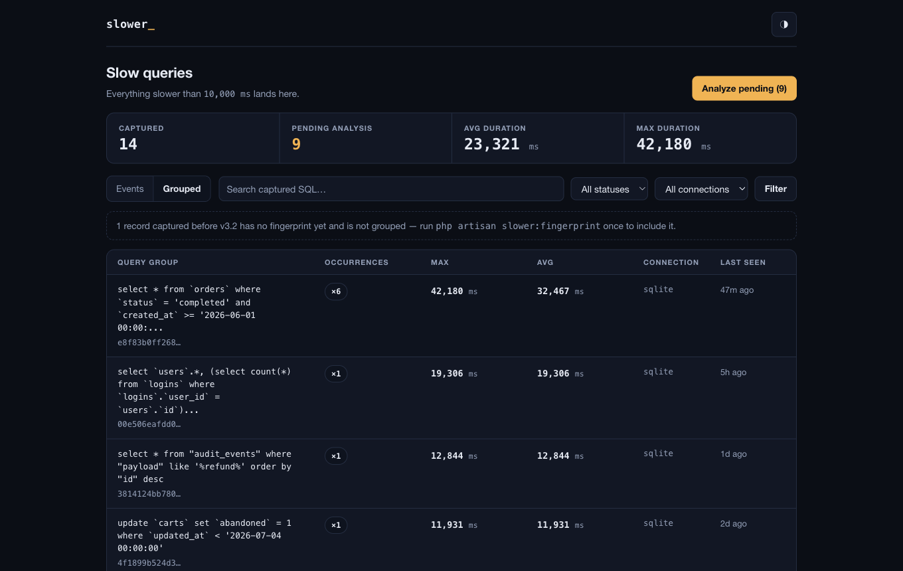

<div align="center">

# Laravel Slower

**Find your slowest database queries — and let AI tell you how to fix them.**

<a href="https://trendshift.io/repositories/10023?utm_source=trendshift-badge&amp;utm_medium=badge&amp;utm_campaign=badge-trendshift-10023" target="_blank" rel="noopener noreferrer"></a>

[](https://packagist.org/packages/halilcosdu/laravel-slower)
[](https://packagist.org/packages/halilcosdu/laravel-slower)
[](https://www.php.net/)
[](https://laravel.com/)
[](LICENSE.md)

<picture>
  <source media="(prefers-color-scheme: dark)" srcset="art/dashboard-dark.png">
  
</picture>

</div>

Laravel Slower watches every query your application runs, captures the ones that cross your threshold, and uses AI to recommend indexes and query rewrites. It speaks to every major LLM — **OpenAI, Anthropic (Claude), Google Gemini, or any custom/self-hosted model** — through one official package. And since **v2.3** it ships with a **built-in dashboard**: install the package and you have a full slow-query UI at `/slower`, with zero frontend work — no npm, no CDN, no assets to publish.

## Contents

- [Features](#features)
- [How it works](#how-it-works)
- [Requirements](#requirements)
- [Installation](#installation)
- [The Dashboard](#the-dashboard)
- [Query groups](#query-groups)
- [Origin context](#origin-context)
- [Production controls](#production-controls)
- [Privacy: what reaches your AI provider](#privacy-what-reaches-your-ai-provider)
- [Queued analysis](#queued-analysis)
- [Events](#events)
- [Configuration](#configuration)
- [AI providers](#ai-providers)
- [Commands and scheduling](#commands-and-scheduling)
- [Programmatic usage](#programmatic-usage)
- [Development and testing](#development-and-testing)

## Features

- 🚨 **Automatic capture** — a `DB::listen` hook logs every query slower than your threshold, with bindings and resolved SQL.
- 🧬 **Query groups** — every capture gets a fingerprint, so 10,000 repeats of the same statement read as *one problem with a counter*, not ten thousand rows.
- 📍 **Origin context** — each capture records where it came from: the route and controller action, queue job, or artisan command, down to the `file:line` of your code that triggered it.
- 🤖 **AI recommendations** — sends the query shape, schema, indexes, origin and a safe `EXPLAIN` plan to your LLM of choice (OpenAI, Anthropic, Gemini, or a custom driver) and stores actionable optimization advice.
- 🔒 **Privacy-first AI payload** — by default only the *parameterized* SQL leaves your app: no binding values, no literals. Raw SQL and bindings are explicit opt-ins with a redactor hook.
- 🧩 **Any major LLM, one variable** — switch providers with `SLOWER_AI_SERVICE`; credentials live in Prism's config, not Slower's. Bring your own model with a one-method driver.
- 📊 **Built-in dashboard** — stats, events & grouped views, search, filters, sorting, query detail with rendered recommendations, one-click *Analyze with AI*, cleanup tools. Dark and light theme, fully self-contained.
- 🎚️ **Production controls** — sampling, a per-request capture cap, and a circuit breaker that backs off when storing logs fails. Safe to leave on under real traffic.
- 🧵 **Queued analysis** — run AI analysis as unique background jobs (`SLOWER_ANALYZE_QUEUE`) so a 30-second LLM round-trip never blocks a request.
- 📣 **Events, not lock-in** — `SlowQueryCaptured` and `SlowQueryFirstSeen` events let you wire alerts to Slack, mail or anything else in a few lines.
- 🛡️ **Safe by default** — the dashboard is only accessible in the `local` environment until you explicitly open it, AI actions are rate-limited and capped, destructive actions ask first.
- ⏰ **Scheduler-friendly commands** — `slower:analyze`, `slower:clean` and `slower:fingerprint` for bulk analysis, retention and upgrades.

## How it works

```text
every query → DB::listen (timed) → slower than threshold → slow_logs → AI analysis → recommendation → /slower
```

1. **Capture.** A `DB::listen` hook times every query. Anything slower than `threshold` (ms) is written to the `slow_logs` table with its SQL, bindings, connection, a **fingerprint** (so repeats group together) and its **origin** (route/job/command + code location). Faster queries are ignored — nothing is stored.
2. **Analyze.** `slower:analyze` (or the dashboard's *Analyze with AI* button, or a queued job) sends each unanalyzed query — the parameterized SQL, table schema, indexes, origin and a safe, read-only `EXPLAIN` plan — to your configured LLM (OpenAI, Claude, Gemini or a custom driver).
3. **Recommend.** The advice (indexes, rewrites, data-type fixes) is stored on the record and rendered as markdown in the dashboard, ready to act on.

## Requirements

- PHP 8.3+
- Laravel 11.x, 12.x or 13.x

## Installation

```bash
composer require halilcosdu/laravel-slower

php artisan vendor:publish --tag="slower-migrations"
php artisan migrate
```

That's it — in your local environment, open **`/slower`** and every captured slow query is waiting for you.

Optionally publish the config file:

```bash
php artisan vendor:publish --tag="slower-config"
```

To enable AI recommendations, [pick a provider](#ai-providers) and set its API key.

## The Dashboard

<div align="center">

</div>

The dashboard lives at `/slower` and gives you:

- **Overview stats** — captured count, pending analysis, average and max duration.
- **Two list modes** — *Events* (every capture) and *Grouped* (one row per query shape with an occurrence counter, avg/max duration and last-seen time). Click a group to drill into its events.
- **Search and filters** — search over the resolved SQL, status and connection filters, sortable columns, pagination — in both modes.
- **Query detail** — formatted SQL, parameterized statement, bindings, the origin (route/job/command and code location), and the AI recommendation rendered from markdown.
- **Actions** — *Analyze with AI* per query (or up to `analyze_pending_limit` pending queries at once), delete, and *clean up older than N days* (`0` wipes everything). Every AI action warns that it may incur provider charges; every destructive action asks for confirmation.

### Authorizing access in production

Exactly like Telescope and Horizon, the dashboard is protected by a gate. By default it only allows access in the `local` environment. To open it up in other environments, define a `viewSlower` gate — for example in `AppServiceProvider`:

```php
use Illuminate\Support\Facades\Gate;

Gate::define('viewSlower', function ($user = null) {
    return $user?->email === 'you@example.com';
});
```

### Dashboard configuration

```php
'dashboard' => [
    'enabled' => env('SLOWER_DASHBOARD_ENABLED', true),
    'path' => env('SLOWER_DASHBOARD_PATH', 'slower'),
    'domain' => env('SLOWER_DASHBOARD_DOMAIN'),
    'middleware' => [
        'web',
        HalilCosdu\Slower\Http\Middleware\Authorize::class,
    ],
    'per_page' => 25,
    'analyze_pending_limit' => 10,
],
```

Set `SLOWER_DASHBOARD_ENABLED=false` to remove the routes entirely, or change `path` to serve it elsewhere. Want to restyle it? `php artisan vendor:publish --tag="laravel-slower-views"`.

> [!WARNING]
> Captured SQL and bindings can contain user data, tokens and other secrets, and analyzing a query sends it (with schema context) to your AI provider as a billable API call. Keep the gate tight, and prune regularly with `slower:clean`.

## Query groups

The same slow query rarely fires once. Every capture is fingerprinted — literals, whitespace, placeholder style and `IN (...)` list sizes are normalized away — so these three executions:

```sql
select * from orders where status = 'pending'  and created_at >= '2026-06-01'
select * from orders where status = 'refunded' and created_at >= '2026-07-01'
SELECT * FROM orders WHERE status = ? AND created_at >= ?
```

are **one group** in the dashboard's *Grouped* view, with an occurrence counter, average/max duration, and last-seen time — so you fix the most frequent offender first instead of scrolling through repeats. Groups are scoped per connection, and clicking one drills down to its individual events.

<div align="center">

</div>

Fingerprints are computed from the parameterized SQL (never from real values) and the algorithm is versioned. Upgrading from an earlier version? Fingerprint your existing records once:

```bash
php artisan slower:fingerprint   # chunked & idempotent — safe to interrupt and re-run
```

## Origin context

"Which query is slow" is only half the answer — *where it comes from* is the half you can act on. Each capture records its origin automatically:

| Execution | What gets recorded |
|---|---|
| HTTP request | route name, URI pattern, `Controller@action` |
| Queue job | the job class |
| Artisan command | the command name |
| All of the above | the first `file:line` of *your* application code in the stack |

The origin is shown on the query detail page and included in the AI prompt — which turns generic advice into *"add `->with('items')` to the query in `OrderController@index`"*.

Two privacy notes, both deliberate defaults:

```dotenv
SLOWER_CAPTURE_ORIGIN=true    # set false to skip origin capture entirely
SLOWER_CAPTURE_USER_ID=false  # opt in to also record the authenticated user id
```

The backtrace is taken only for queries that already crossed the threshold (so there is no per-query overhead), with `DEBUG_BACKTRACE_IGNORE_ARGS` — argument values never enter the trace.

## Production controls

Designed to be left on under real traffic:

```dotenv
SLOWER_SAMPLE_RATE=1.0        # capture this fraction of threshold-exceeding queries (0.0–1.0)
SLOWER_MAX_PER_EXECUTION=50   # hard cap per request / job / command run
```

- **Sampling** — on very high-traffic apps, capture a representative fraction instead of every slow query. Counts become approximate; your database stays calm.
- **Per-execution cap** — one runaway request or job can produce hundreds of slow queries; the cap stops it from flooding the log table.
- **Circuit breaker** — if storing a capture *itself* fails (full disk, dropped table), Slower backs off for 60 seconds instead of adding a failed INSERT to every slow query in the process. Failures are still `report()`ed.
- **Self-capture guard** — queries touching Slower's own table are never captured, so the logger cannot feed itself.

## Privacy: what reaches your AI provider

The AI payload is **safe by default** — this is the exact contract:

| Payload part | Sent by default? | Contains |
|---|---|---|
| Parameterized SQL (`... where id = ?`) | ✅ yes | query shape, no values |
| Schema & indexes of referenced tables | ✅ yes | column names/types, index definitions |
| Origin context | ✅ yes (when captured) | route/job/command, code location |
| `EXPLAIN` output | ✅ yes (configurable) | the plan — *may echo literal values on some drivers* |
| Raw SQL with real values | ❌ opt-in | literals: emails, tokens, ids |
| Bindings | ❌ opt-in | the actual parameter values |

If your provider needs the real values for better advice, opt in explicitly — and put a redactor in front for defense in depth:

```dotenv
SLOWER_AI_SEND_RAW_SQL=true
SLOWER_AI_SEND_BINDINGS=true
```

```php
// config/slower.php
'ai_payload' => [
    'send_raw_sql' => env('SLOWER_AI_SEND_RAW_SQL', false),
    'send_bindings' => env('SLOWER_AI_SEND_BINDINGS', false),
    'redactor' => App\Support\SlowerRedactor::class,
],
```

```php
namespace App\Support;

use HalilCosdu\Slower\Contracts\PayloadRedactor;

class SlowerRedactor implements PayloadRedactor
{
    public function redactBindings(array $bindings): array
    {
        return array_map(
            fn ($value) => is_string($value) && str_contains($value, '@') ? '[email]' : $value,
            $bindings,
        );
    }

    public function redactRawSql(string $rawSql): string
    {
        return preg_replace('/\b[\w.+-]+@[\w-]+\.[\w.]+\b/', '[email]', $rawSql);
    }
}
```

A misconfigured redactor (a class that doesn't implement the contract) throws instead of silently passing secrets. In strict environments also set `SLOWER_AI_RECOMMENDATION_USE_EXPLAIN=false`, since an `EXPLAIN` plan can echo literal values from the query.

## Queued analysis

An LLM round-trip takes seconds; by default Slower analyzes synchronously (no worker needed). On any app with a queue, flip one variable and analysis becomes background work:

```dotenv
SLOWER_ANALYZE_QUEUE=default   # any queue name; unset = synchronous
```

- The dashboard's *Analyze* buttons dispatch jobs and return immediately.
- `php artisan slower:analyze --queue` queues every pending record instead of processing them inline.
- Jobs are **unique per record** — double-clicks and overlapping scheduler runs can't queue duplicate (billable) analyses.
- Failures follow your queue's retry semantics, and a record is only marked analyzed when a recommendation was actually stored.

```php
// A worker for that queue, and you're done:
php artisan queue:work --queue=default
```

## Events

Slower ships **events, not notification channels** — wire them to whatever your team uses:

- `HalilCosdu\Slower\Events\SlowQueryCaptured` — fired for every stored capture.
- `HalilCosdu\Slower\Events\SlowQueryFirstSeen` — fired only the first time a query *shape* is ever captured. This is the "a new slow query appeared" signal, without the noise of repeats.

A complete Slack alert in ~15 lines — listen for first-seen shapes and notify:

```php
// app/Providers/AppServiceProvider.php
use HalilCosdu\Slower\Events\SlowQueryFirstSeen;
use Illuminate\Support\Facades\Event;
use Illuminate\Support\Facades\Notification;

public function boot(): void
{
    Event::listen(function (SlowQueryFirstSeen $event) {
        Notification::route('slack', config('services.slack.alerts_webhook'))
            ->notify(new \App\Notifications\NewSlowQuery($event->record));
    });
}
```

```php
// app/Notifications/NewSlowQuery.php (the interesting part)
public function toSlack(object $notifiable): SlackMessage
{
    $origin = $this->record->origin['action'] ?? $this->record->origin['job'] ?? 'unknown origin';

    return (new SlackMessage)
        ->text(sprintf(
            '🐌 New slow query (%.0f ms) from %s: %s',
            $this->record->time,
            $origin,
            \Illuminate\Support\Str::limit($this->record->sql, 120),
        ));
}
```

## Configuration

This is the full contents of the published config file:

```php
use HalilCosdu\Slower\Http\Middleware\Authorize;
use HalilCosdu\Slower\Models\SlowLog;

return [
    'enabled' => env('SLOWER_ENABLED', true),
    'threshold' => env('SLOWER_THRESHOLD', 10000), // ms
    'ai_service' => env('SLOWER_AI_SERVICE', 'openai'),
    'capture' => [
        'sample_rate' => env('SLOWER_SAMPLE_RATE', 1.0),
        'max_per_execution' => env('SLOWER_MAX_PER_EXECUTION', 50),
        'origin' => [
            'enabled' => env('SLOWER_CAPTURE_ORIGIN', true),
            'user_id' => env('SLOWER_CAPTURE_USER_ID', false),
        ],
    ],
    'resources' => [
        'table_name' => (new SlowLog)->getTable(),
        'model' => SlowLog::class,
    ],
    'dashboard' => [
        'enabled' => env('SLOWER_DASHBOARD_ENABLED', true),
        'path' => env('SLOWER_DASHBOARD_PATH', 'slower'),
        'domain' => env('SLOWER_DASHBOARD_DOMAIN'),
        'middleware' => [
            'web',
            Authorize::class,
        ],
        'per_page' => 25,
        'analyze_pending_limit' => 10,
    ],
    'ai_recommendation' => env('SLOWER_AI_RECOMMENDATION', true),
    // null = analyze synchronously; a queue name = analyze as background jobs
    'analyze_queue' => env('SLOWER_ANALYZE_QUEUE'),
    'ai_payload' => [
        'send_raw_sql' => env('SLOWER_AI_SEND_RAW_SQL', false),
        'send_bindings' => env('SLOWER_AI_SEND_BINDINGS', false),
        'redactor' => null, // class-string implementing Contracts\PayloadRedactor
    ],
    // null → a sensible low-cost default for the selected provider
    'recommendation_model' => env('SLOWER_AI_RECOMMENDATION_MODEL'),
    'recommendation_use_explain' => env('SLOWER_AI_RECOMMENDATION_USE_EXPLAIN', true),
    'ignore_explain_queries' => env('SLOWER_IGNORE_EXPLAIN_QUERIES', true),
    'ignore_insert_queries' => env('SLOWER_IGNORE_INSERT_QUERIES', true),
    'prompt' => env('SLOWER_PROMPT', '...'), // the system prompt sent to the AI
];
```

A few keys worth tuning:

- **`threshold`** — the millisecond bar for "slow". Lower it in staging to surface more, raise it in production to keep the table lean.
- **`capture.sample_rate` / `capture.max_per_execution`** — the [production controls](#production-controls) for high-traffic apps.
- **`ai_recommendation`** — set to `false` to keep logging slow queries while never calling an AI API (no charges).
- **`analyze_queue`** — a queue name to make analysis [background work](#queued-analysis); `null` keeps it synchronous.
- **`ai_payload`** — the [privacy contract](#privacy-what-reaches-your-ai-provider) for what reaches your provider.
- **`recommendation_use_explain`** — attaches a safe, read-only `EXPLAIN` plan to the prompt for sharper advice.

## AI providers

Slower talks to every major LLM through one official package — [Prism](https://prismphp.com). There are **no provider credentials in Slower's own config**: you pick a provider with a single variable, and Prism reads the key from its own config (`config/prism.php`), which in turn reads the conventional environment variables.

```dotenv
SLOWER_AI_SERVICE=openai   # openai · anthropic · gemini · ollama · … · or a custom driver
```

| `ai_service` | Default model |
|---|---|
| `openai` *(default)* | `gpt-5.4-mini` |
| `anthropic` | `claude-haiku-4-5` |
| `gemini` | `gemini-2.5-flash` |
| any other Prism provider | *you must set the model* |

Override any default with `SLOWER_AI_RECOMMENDATION_MODEL`.

> [!NOTE]
> Upgrading from an OpenAI-only version? Nothing to change — Prism reads your existing `OPENAI_API_KEY`, and a boot-time bridge still honors a legacy `slower.open_ai.api_key`.

Below is the exact setup for each major provider. In every case **only two lines are required** — `SLOWER_AI_SERVICE` and the provider's API key; everything else is an optional override, shown commented out with its default value.

### OpenAI

```dotenv
SLOWER_AI_SERVICE=openai
OPENAI_API_KEY=sk-...

# Optional overrides (defaults shown)
# SLOWER_AI_RECOMMENDATION_MODEL=gpt-5.4-mini
# OPENAI_URL=https://api.openai.com/v1     # point at Azure OpenAI or a proxy
# OPENAI_ORGANIZATION=
# OPENAI_PROJECT=
```

Get a key at [platform.openai.com](https://platform.openai.com/api-keys).

### Anthropic (Claude)

```dotenv
SLOWER_AI_SERVICE=anthropic
ANTHROPIC_API_KEY=sk-ant-...

# Optional overrides (defaults shown)
# SLOWER_AI_RECOMMENDATION_MODEL=claude-haiku-4-5
# ANTHROPIC_API_VERSION=2023-06-01
# ANTHROPIC_URL=https://api.anthropic.com/v1
```

Get a key at [console.anthropic.com](https://console.anthropic.com/).

### Google Gemini

```dotenv
SLOWER_AI_SERVICE=gemini
GEMINI_API_KEY=...

# Optional overrides (defaults shown)
# SLOWER_AI_RECOMMENDATION_MODEL=gemini-2.5-flash
# GEMINI_URL=https://generativelanguage.googleapis.com/v1beta/models
```

Get a key at [aistudio.google.com](https://aistudio.google.com/apikey).

### Self-hosted & OpenAI-compatible (Ollama, LM Studio, OpenRouter, Groq, …)

Any Prism provider works. These have **no built-in default model**, so you must name one:

```dotenv
SLOWER_AI_SERVICE=ollama
SLOWER_AI_RECOMMENDATION_MODEL=qwen2.5-coder

# Optional overrides (default shown)
# OLLAMA_URL=http://localhost:11434
```

### A fully custom driver

For a bespoke backend, register a driver in a service provider — no HTTP code required from Slower:

```php
use HalilCosdu\Slower\AiServiceDrivers\AiServiceManager;
use HalilCosdu\Slower\AiServiceDrivers\Contracts\AiServiceDriver;

app(AiServiceManager::class)->extend('my-llm', fn () => new class implements AiServiceDriver
{
    public function analyze(string $userMessage): ?string
    {
        // Call your model. Return the recommendation text, or null to retry later.
    }
});
```

Then set `SLOWER_AI_SERVICE=my-llm`.

> [!TIP]
> Model ids move fast. If a default drifts, pin the current low-cost model for your provider with `SLOWER_AI_RECOMMENDATION_MODEL`. AI requests time out after Prism's default of 30 seconds — raise it with `PRISM_REQUEST_TIMEOUT` (seconds) for very large schemas or slower models.

## Commands and scheduling

```bash
php artisan slower:analyze           # analyze every record where is_analyzed=false
php artisan slower:analyze --queue   # ...as unique background jobs instead
php artisan slower:clean 15          # delete records older than 15 days
php artisan slower:fingerprint       # one-time: fingerprint records captured before v3.2
```

Run them on a schedule so analysis and retention take care of themselves:

```php
use HalilCosdu\Slower\Commands\AnalyzeQuery;
use HalilCosdu\Slower\Commands\SlowLogCleaner;

protected function schedule(Schedule $schedule): void
{
    $schedule->command(AnalyzeQuery::class)->runInBackground()->daily();
    $schedule->command(SlowLogCleaner::class)->runInBackground()->daily();
}
```

## Programmatic usage

Everything the dashboard does is available through the `Slower` facade and the `SlowLog` model.

```php
use HalilCosdu\Slower\Facades\Slower;
use HalilCosdu\Slower\Models\SlowLog;

// Analyze a single captured query — returns the analyzed model.
$record = SlowLog::first();

Slower::analyze($record);

$record->raw_sql;        // select count(*) as aggregate from "product_prices" where ...
$record->recommendation; // the AI's optimization advice (markdown)
```

Because slow queries are plain Eloquent records, you can query and act on them however you like:

```php
use HalilCosdu\Slower\Facades\Slower;
use HalilCosdu\Slower\Models\SlowLog;

// How many queries are still waiting for analysis?
$pending = SlowLog::where('is_analyzed', false)->count();

// Analyze the twenty slowest unanalyzed queries.
SlowLog::query()
    ->where('is_analyzed', false)
    ->orderByDesc('time')
    ->limit(20)
    ->get()
    ->each(fn (SlowLog $log) => Slower::analyze($log));

// The most frequent slow query shapes (what the Grouped view shows).
SlowLog::query()
    ->whereNotNull('fingerprint')
    ->selectRaw('fingerprint, count(*) as occurrences, max(time) as max_time')
    ->groupBy('fingerprint')
    ->orderByDesc('occurrences')
    ->limit(5)
    ->get();

// Where did this one come from?
$record->fingerprint;        // 40-char shape hash, shared by all repeats
$record->origin;             // ['type' => 'http', 'route' => 'orders.index',
                             //  'action' => 'App\...\OrderController@index',
                             //  'frame' => 'app/Http/Controllers/OrderController.php:38']
```

<details>
<summary><strong>Example recommendation</strong></summary>

1. Indexing: consider adding a composite index on `product_id`, `price`, and `discount_total`:

```sql
CREATE INDEX idx_product_prices
ON product_prices (product_id, price, discount_total);
```

2. Data types: remove the quotes around numeric comparisons so the index can actually be used:

```sql
SELECT COUNT(*) AS aggregate
FROM product_prices
WHERE product_id = 1 AND price = 0 AND discount_total > 0;
```

3. Statistics: run `ANALYZE product_prices;` so the query planner has fresh statistics to work with.

</details>

## Development and testing

```bash
composer test       # Pest test suite
composer analyse    # PHPStan level 5
composer format     # Laravel Pint
composer start      # build the workbench demo app (seeded) and serve the dashboard
```

## Changelog

Please see [CHANGELOG](CHANGELOG.md) for more information on what has changed recently.

## Contributing

Please see [CONTRIBUTING](CONTRIBUTING.md) for details.

## Security Vulnerabilities

Please review [our security policy](../../security/policy) on how to report security vulnerabilities.

## Credits

- [Halil Cosdu](https://github.com/halilcosdu)
- [All Contributors](../../contributors)

## License

The MIT License (MIT). Please see [License File](LICENSE.md) for more information.
